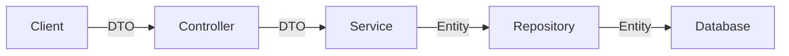

# Giải Thích Chi Tiết: DTO & Lỗi Thường Gặp

Tài liệu này giải đáp các thắc mắc của bạn về lỗi `UnsatisfiedDependencyException`, bản chất của DTO, và ý nghĩa các Annotation.

---

## 1. Phân Tích Lỗi: "No property 'existByUsername' found"

### Lỗi bạn gặp phải:
```text
Error creating bean with name 'userRepository'... No property 'existByUsername' found for type 'User'
```

### Nguyên nhân:
Trong Spring Data JPA, tên hàm trong Repository phải tuân theo quy tắc đặt tên chính xác.
-   Bạn đã viết: `existByUsername` (thiếu chữ **s**).
-   Spring hiểu nhầm: Nó tưởng bạn đang tìm một thuộc tính tên là `existByUsername` trong class `User`, nhưng không tìm thấy -> Báo lỗi.

### Cách sửa:
Sửa tên hàm trong `UserRepository.java` thành `existsByUsername` (có chữ **s**).
Từ khóa đúng là **`exists`** (tồn tại) chứ không phải `exist`.

```java
// Sai
boolean existByUsername(String username);

// Đúng
boolean existsByUsername(String username);
```
*Lưu ý: Nếu bạn đã sửa trong code rồi mà vẫn lỗi, hãy thử Re-run lại ứng dụng để nó biên dịch lại.*

---

## 2. DTO (Data Transfer Object) Là Gì?

### Bản chất thực sự
DTO (Data Transfer Object) hiểu đơn giản là **"Cái hộp đóng gói dữ liệu"**.
Nó chỉ là một class Java thuần túy (POJO) chứa các field (thuộc tính) để hứng dữ liệu từ người dùng gửi lên hoặc trả dữ liệu về. Nó **không** chứa logic nghiệp vụ, không kết nối Database.

### Tại sao lại cần DTO? Tại sao không dùng luôn Entity (`User`)?
Bạn hoàn toàn có thể dùng Entity `User` để nhận dữ liệu từ Controller, nhưng điều đó **rất nguy hiểm** và **thiếu linh hoạt**.

1.  **Bảo mật (Security)**:
    *   Entity `User` có trường `password`, `role`, `salary`...
    *   Nếu dùng Entity làm đầu vào API, hacker có thể gửi thêm field `role: "ADMIN"` trong JSON. Nếu bạn không chặn, hacker có thể tự cấp quyền Admin cho mình.
    *   -> **DTO giải quyết**: Tạo `UserCreationRequest` chỉ chứa `username`, `password`. Hacker có gửi `role` cũng vô dụng vì DTO không có field đó để hứng.

2.  **Sự khác biệt dữ liệu (Decoupling)**:
    *   Database lưu `firstName`, `lastName`.
    *   Nhưng Client muốn gửi lên `fullName`.
    *   -> **DTO giải quyết**: DTO nhận `fullName`, sau đó Service sẽ tách ra thành `firstName`, `lastName` để lưu vào Entity.

3.  **Phiên bản hóa (Versioning)**:
    *   Nếu sửa tên cột trong Database, Entity phải sửa theo. Nếu dùng Entity trả về cho Client, Client cũng bị lỗi theo.
    *   Dùng DTO giúp Database thay đổi thoải mái, chỉ cần map lại trong Service, API vẫn giữ nguyên cho Client.

### Vị trí trong kiến trúc

*   **Controller**: Nhận **DTO** (Request).
*   **Service**: Nhận **DTO**, chuyển đổi (Map) sang **Entity**, xử lý logic, gọi Repository.
*   **Repository**: Làm việc với **Entity** và Database.

---

## 3. Giải Thích Các Annotation trong `UserUpdateRequest.java`

File `UserUpdateRequest.java` của bạn đang dùng thư viện **Lombok** để giảm bớt code thừa (boilerplate code).

```java
@Data
@NoArgsConstructor
@AllArgsConstructor
@Builder
@FieldDefaults(level = AccessLevel.PRIVATE)
public class UserUpdateRequest { ... }
```

| Annotation | Tác dụng | Tại sao cần? |
| :--- | :--- | :--- |
| **`@Data`** | Tự động sinh `Getter`, `Setter`, `toString()`, `equals()`, `hashCode()`. | Để bạn có thể lấy/gán dữ liệu (`request.getPassword()`) mà không cần viết hàng trăm dòng code getter/setter. |
| **`@NoArgsConstructor`** | Tạo Constructor không tham số: `public UserUpdateRequest() {}`. | **Bắt buộc** cho các thư viện như Jackson (để đọc JSON) và Hibernate hoạt động. Nếu thiếu, khi gửi JSON lên sẽ bị lỗi. |
| **`@AllArgsConstructor`** | Tạo Constructor có đầy đủ tham số. | Cần thiết để `@Builder` hoạt động (Builder cần constructor này để tạo object). |
| **`@Builder`** | Cung cấp Builder Pattern: `UserUpdateRequest.builder().password("...").build()`. | Giúp tạo object một cách rõ ràng, dễ đọc hơn so với `new UserUpdateRequest(...)` với quá nhiều tham số. |
| **`@FieldDefaults`** | `level = AccessLevel.PRIVATE`: Tự động coi tất cả các field là `private`. | Giúp bạn đỡ phải gõ từ khóa `private` trước mỗi biến. Code gọn hơn. |

---

## 4. Luồng Hoạt Động Cụ Thể (Flow)

Ví dụ luồng **Update User**:

1.  **Client (Postman/Frontend)**:
    *   Gửi Request: `PUT /users/123`
    *   Body JSON: `{ "password": "newPass", "firstName": "Huy" }`

2.  **Controller (`UserController`)**:
    *   Nhận Request.
    *   Spring tự động map JSON vào **DTO** `UserUpdateRequest`.
    *   Gọi `userService.updateUser("123", request)`.

3.  **Service (`UserService`)**:
    *   Nhận `id` và `request` (DTO).
    *   Gọi `userRepository.findById("123")` để lấy **Entity** `User` cũ từ DB lên (nếu không thấy thì báo lỗi).
    *   **Mapping**: Lấy dữ liệu từ `request` (DTO) gán sang `User` (Entity).
        *   `user.setPassword(request.getPassword())`
        *   `user.setFirstName(request.getFirstName())`
    *   Gọi `userRepository.save(user)` để lưu lại.

4.  **Repository (`UserRepository`)**:
    *   Nhận **Entity** `User` đã sửa.
    *   Sinh câu lệnh SQL `UPDATE user SET password = '...', ... WHERE id = '123'`.
    *   Gửi xuống Database.

5.  **Database**:
    *   Cập nhật dữ liệu và trả về kết quả thành công.

---

## Tổng Kết
*   **Lỗi `existBy...`**: Do sai chính tả, sửa thành `existsBy...`.
*   **DTO**: Là cái hộp để vận chuyển dữ liệu an toàn giữa Client và Server, tách biệt với Database.
*   **Lombok Annotations**: Giúp code ngắn gọn, tập trung vào logic thay vì viết code thủ công (getter/setter).

